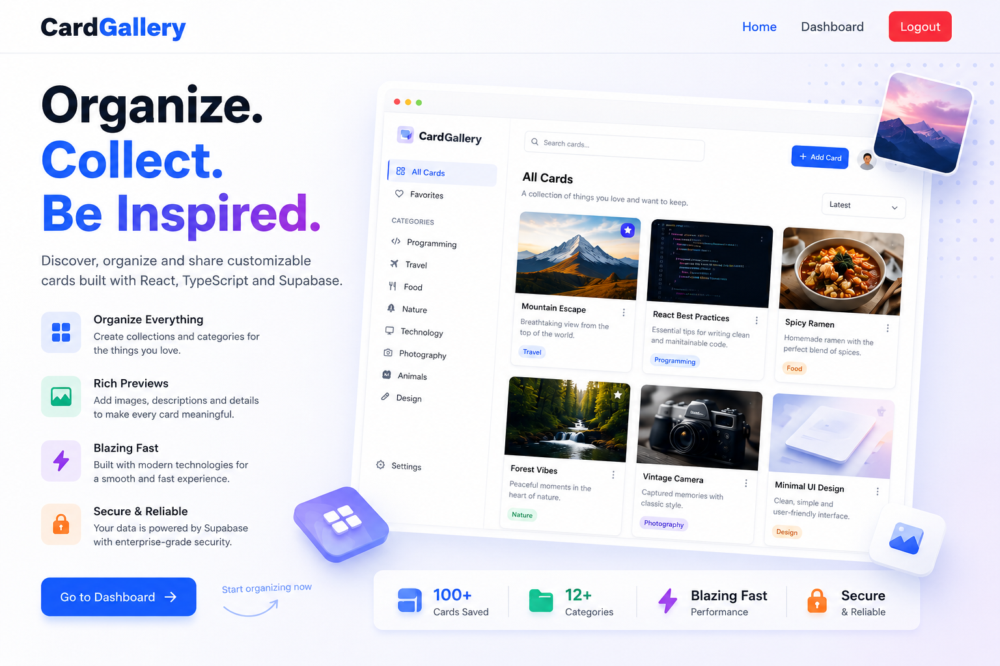

# Card Gallery


A modern full-stack web application for browsing, creating, organizing, and managing image-based cards. Built with **React**, **TypeScript**, **Tailwind CSS**, and **Supabase**, the platform provides secure authentication, image uploads, category management, search and filtering, and a fully responsive user interface.


## Live Demo

**URL:** https://cardgallery.vercel.app/

---

## Table of Contents

- [Screenshots](#screenshots)
- [Features](#features)
- [Tech Stack](#tech-stack)
- [Project Structure](#project-structure)
- [Installation](#installation)
- [Environment Variables](#environment-variables)
- [Running Locally](#running-locally)
- [Usage](#usage)
- [Deployment](#deployment)
- [Roadmap](#roadmap)
- [Lessons Learned](#lessons-learned)
- [License](#license)
- [Author](#author)

---

## Features

- User authentication (registration and login)
- Image upload via Supabase Storage
- Create, edit, and delete cards
- Public card gallery
- Personal user dashboard
- Category management
- Search functionality across cards
- Filtering by category
- Fully responsive design across devices
- Skeleton loading states for improved perceived performance
- Row Level Security (RLS) for data protection

---

## Tech Stack

**Frontend**
- React
- TypeScript
- Vite
- Tailwind CSS
- React Router DOM

**Backend & Database**
- Supabase
- PostgreSQL
- Supabase Authentication
- Supabase Storage

**UI & Utilities**
- React Hot Toast
- React Icons
- React Modal
- date-fns

**Development Tools**
- ESLint
- Git
- GitHub
- Visual Studio Code

---

## Project Structure

```
card-gallery
├─ src
│  ├─ App.tsx
│  ├─ assets                  # Static images and screenshots
│  ├─ components
│  │  ├─ auth                 # Route protection and auth-related components
│  │  ├─ cards                # Card display, grid, modal, search, and filtering
│  │  ├─ dashboard            # Dashboard-specific components
│  │  ├─ layout               # Navbar and layout components
│  │  └─ ui                   # Reusable UI components (skeleton loaders, etc.)
│  ├─ context                 # Auth and Card context providers
│  ├─ hooks                   # Custom hooks (auth, cards, categories)
│  ├─ lib                     # Supabase client configuration
│  ├─ pages                   # Route-level pages (Home, Dashboard, Login, Register)
│  ├─ types                   # Shared TypeScript types
│  └─ main.tsx
├─ public
├─ index.html
├─ package.json
├─ tsconfig.json
└─ vite.config.ts
```

---

## Installation

Clone the repository:

```bash
git clone https://github.com/Ridamn/card-gallery.git
```

Navigate to the project directory:

```bash
cd card-gallery
```

Install dependencies:

```bash
npm install
```

---

## Environment Variables

Create a `.env.local` file in the project root and configure the following variables:

```env
VITE_SUPABASE_URL=YOUR_SUPABASE_URL
VITE_SUPABASE_ANON_KEY=YOUR_SUPABASE_ANON_KEY
```

---

## Running Locally

Start the development server:

```bash
npm run dev
```

The application will be available at:

```
http://localhost:5173
```

Build for production:

```bash
npm run build
```

Preview the production build:

```bash
npm run preview
```

---

## Usage

**Browse Cards**
View all publicly available cards from the Home page.

**Register & Login**
Create an account or sign in securely via Supabase Authentication.

**Create a Card**
From the Dashboard, select **+ Add Card** to add a new card with an image, description, and category.

**Manage Cards**
Users can edit or delete only the cards they own.

**Search & Filter**
Search cards by title and refine results using category filters.

---

## Deployment

This project is deployed using **Vercel**. To deploy your own instance:

1. Push the project to GitHub.
2. Import the repository into Vercel.
3. Configure the required environment variables.
4. Deploy.

---

## Roadmap

- [ ] Favorite cards
- [ ] Dark mode
- [ ] User profile pages
- [ ] Like and save cards
- [ ] Pagination
- [ ] Card sharing

---

## Lessons Learned

This project was developed as a hands-on exercise in building full-stack applications with React and Supabase. Key takeaways include:

- Designing reusable, composable React components
- Managing application state using the Context API and custom hooks
- Implementing authentication flows with Supabase Auth
- Performing CRUD operations against a Supabase/PostgreSQL backend
- Uploading and managing files with Supabase Storage
- Enforcing data access rules with Row Level Security (RLS)
- Building responsive interfaces with Tailwind CSS
- Structuring a scalable, maintainable React project

---

## License

This project is licensed under the [MIT License](LICENSE).

---

## Author

**Ridam Saxena**
GitHub: [@Ridamn](https://github.com/Ridamn)
